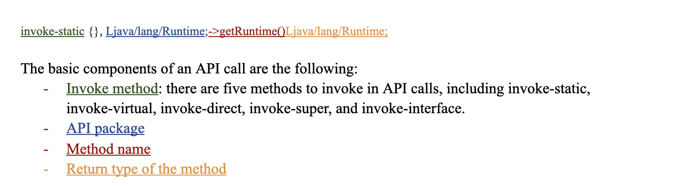

# Malware Detection
Authors: [**Yikai Hao**](https://github.com/YikaiHao), [**Yu-Chieh Chen**](https://github.com/yuc399), [**Ruoyu Liu**](https://github.com/rul141)

[Check on GitHub Repo](https://github.com/YikaiHao/DSC180_Winter)

## Overview
As the technology grows fast in recent years, more and more people cannot live without cell phones. It is important to protect users’ data for cell phone companies and operating system providers. Therefore, detecting malwares based on the code they have can avoid publishing of malwares and prohibiting them from the source. This report aims at finding a model which can detect malwares accurately and with a small computational cost. It uses different matrices and graphs to search the relationships between applications and detecting malwares based on the similarity. As a result, the best model can achieve a test accuracy around 99%.

## Data Overview
### Data Description
The data source is called Android Malware Dataset (AMD). The dataset is published in 2017 by the Argus Lab from the University of South Florida. This data source is used by many other malware detection papers and widely used in the research domain. We then extract the smali file after decompiling the APK(Android Application Package).

### Smali 
In order to analyze the smali files, we should understand the structure of it. Therefore, here is the description of the smali files and the features contained in the smali files.

### API Calls
In order to understand which part of the smali files do the malicious action, we put our attention on API (Application Programming Interface) calls. There are four main components in an API call.

### Database 
We design a new database for storing data.

## Model 
### Feature Distribution
In order to check whether the features we generate are useful for checking malwares, some Exploratory Data Analysis (EDA) has done on features. We check the difference between unique values among features considered the type of applications. The result shows that our features can clearly identify the different types of applications since the value between different types of applications are large. 

| Type | #Unique API | #Unique API Lib | #Unique API Name | #Unique API Return Type |
|----------|-----------|----------|-----------|-------|
| Malware | 792.08       | 277.34   | 359.55    | 172.18   |
| Benign | 7041.15   | 2551.21   | 2571.26    | 1485.79   |

As we can see from the graphs, the distribution of every application type for every feature is different.

### Hindroid 
HinDroid is the baseline model we use for our report. It contains different types of kernels and the meaning behind each kernel is different. It uses the features we extract from the data generating process to build some matrices. Each matrix shows a type of relationship between apis or applications. Each matrix is an adjacent matrix for a graph with a specialized relationship. By choosing different types of matrices we want to combine together, we get the kernel we have. Then we will be able to use the custom kernels and put in different classifiers like SVM or Random Forest for malware detection. 

The four types of matrices are: A, B, P, and I matrices. 
- A matrix shows the connection among apis and applications. The value within the A matrix will be one if the application contains the api.
- B matrix shows the connection between apis. The value within the B matrix shows whether two apis are contained in the same code block.
- P matrix also shows the connection between apis. The value within the P matrix shows whether two apis use the same package.
- I matrix shows the connection within the apis. The value within the I matrix shows whether two apis use the same invoke type.

Currently, due to the large size of the unique apis we get, we are not able to calculate out the I matrix yet. Therefore, the kernel we have now for HinDroid is AA^t, ABA^t, APA^t, and APBP^tA^t. 

### New Model
The HinDroid model runs pretty slow since there are a large number of APIs. However, lots of APIs only appear once among all applications and they are meaningless for detecting malwares. In addition, there are also some APIs which appeared in almost every application. Those APIs are also not meaningful enough to help us pick out the malwares. Therefore, new models are being considered and built. Based on the logic of HinDroid, we try to develop some new matrices to replace the original matrices which will have a faster speed and similar accuracy.

#### Reduce API / PACK
The inspiration of this method comes from the MAMADROID. Instead of using the whole API call, API name and API library have been selected separately. The number of unique API calls for around 2000 applications are originally over 1,000,000. We design two new matrices based on the separation of values in an API call. 

- Reduce API: This matrix only contains the API Name, which is the red part in the example. The new matrix size is around 130,000 x 130,000, which is way smaller than the original A matrix.
- Reduce Pack: This matrix only contains the API Library, which is the blue part in the example. The new matrix size is around 350,000 x 350,000. The size is about ⅔ smaller than the original A matrix

#### TF-IDF
Besides Reduce API and Reduce Pack, we are also considering can we select out some APIs which are considered “important” for detecting malwares. The method we choose is TF-IDF(term frequency - inverse document frequency). It is a useful method to check the importance of a word for a document. We generate a corpus list which each element in the list is representing a corpus for an application. In each corpus, it contains all API calls. We then use the TF-IDF to get a token score for each API call. After calculating the mean score over all corpus, part of the API calls are selected out according to their rank. The numbers we select out are Top1000, Top2000, Top5000, and Top10000.

| Top3 API Example Rank by TF-IDF | 
|----------|
| Ljava/lang/StringBuilder;-> append() | 
| Ljava/lang/StringBuilder;-> toString() | 
| Ljava/lang/Integer;->valueOf() |

#### NEW FEATURES
New features are also being considered to build new matrices. We use the return type as our new feature and build a matrix called R. The element in the R matrix represents whether two applications are using the same return type. R matrix can replace the original A matrix and its size is only around 170,000 x 170,000. As the feature description part shown, the return type is also a useful feature to detect malwares. Additionally, in order to build a new kernel for the R matrix, the new B_R matrix represents whether two return types are in the same code block. Therefore, we have two different kernels - RR and RB_RR. 

What’s more, we also built a new I matrix after finishing the API reduction. This also provides more kernel options while putting the features into classifiers.

### Word2Vec

### Node2Vec

### Metapath2Vec

### New Model 

## Result 
Below are the results of different models. 

### Classifiers 
After different models are built, SVM(Support-Vector Machines), Random Forest, and Gradient Boosting are selected as classifiers while doing the final malware detection. SVM is the baseline classifier we choose. It uses different matrices as custom kernels to classify the type of applications. Random Forest and Gradient Boosting both use decision trees as their base. Decision tree is a tree model in which each node represents a decision rule that separates the dataset. Random forest uses the idea of “Bagging”. It builds lots of decision trees at the same time using a subset from the dataset. Then, Random Forest will combine the result with weight and produce the final prediction. Gradient Boosting uses another idea called “Boosting”. It will also build lots of decision trees. And Gradient Boosting will update the newest model by making improvement on the last model. 

The classifier with highest accuracy will be chosen as the classifier of a specific model. As the result table shows, most classifiers will be SVM. However, the Node2vec model shows a preference on Gradient Boosting.

### Result Table

### Research on misclassified applications
After seeing the result, we do some research on the misrecognized applications. As the table shown, the original HinDroid model with metapath AA and classifier SVM only missed 3 applications. Those three applications are considered to be False Positive, which means that they should be benigns but identified as malwares. We select those 3 applications out and find that they are all in the category Random application. By checking the features used for malware detection and comparing it with the 25% - 75% range for both malwares and benigns, those applications are at the boundary of malwares and benigns. Therefore, it is reasonable for the classifier to misrecognizing those applications. In addition, as the Data Description section mentioned, random applications are selected randomly out of apkpure. There is a small possibility that those three applications are actually malwares.

## Conclusion 
In this report, we implement different methods for malware detection. Based on the weakness we find in using HinDroid, we also design some new matrices and kernels in order to save space and time. As the result section shows, the outcome is positive. With a much smaller matrix and time complexity, the new model can perform as well as the original HinDroid model. Although graph-based models do not perform as well as kernel based models, they are achieving a high accuracy around 95%. Graph is still a useful strategy to consider while detecting malwares since it can catch the cluster relationship among applications.

There is lots of future exploration that can be done based on current results. For example, we can implement the multi-kernel idea to combine high accuracy models together in order to improve our overall accuracy. The reducing API by using TF-IDF can also be applied to other research areas while we want to save time complexity. New matrix with return types as its element also performs well on test accuracy. Thus, some further studies can be done on this feature. We can also extract out most common applications which are misclassified and understand the reason behind it. 

## Reference 
[1] Hou, Shifu and Ye, Yanfang and Song, Yangqiu and Abdulhayoglu, Melih. 2017. HinDroid: An Intelligent Android Malware Detection System Based on Structured Heterogeneous Information Network. 

[2] Mikolov, Tomas and Corrado, Greg and Chen, Kai and Dean, Jeffrey. 2013. Efficient Estimation of Word Representations in Vector Space.  

[3] Grover, Aditya and Leskovec, Jure. 2016. node2vec: Scalable Feature Learning for Networks.  

[4] Dong, Yuxiao and Chawla, Nitesh and Swami, Ananthram. 2017. metapath2vec: Scalable Representation Learning for Heterogeneous Networks 
